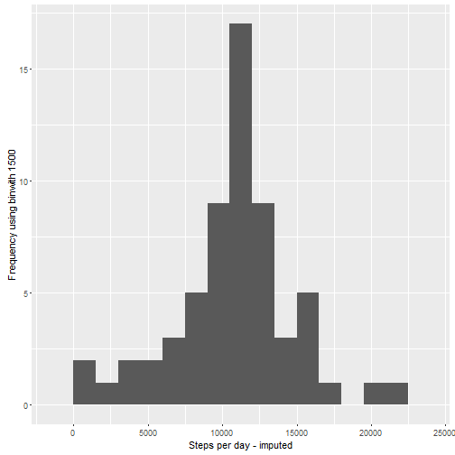
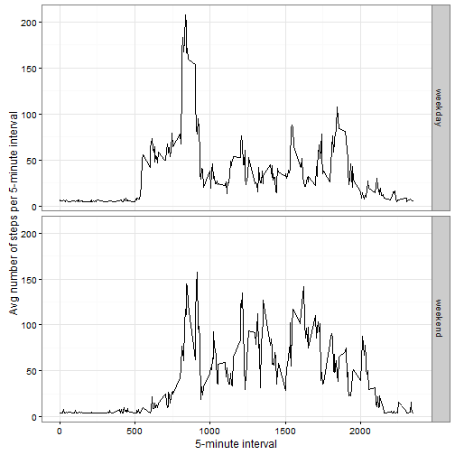

# Reproducible Research: Peer assessment 1
### *Steven Devisch*
### *February 20th 2016*
###### Github repository : https://github.com/viskinho/RepData_PeerAssessment1
###### Note that the heading level is driven by the number of '#####'s
## Introduction
Purpose of this assignment is to write a report that answers the questions detailed below. 

Ultimately, one was required  to complete the entire assignment in a single R markdown document
that can be processed by knitr and be transformed into an HTML file.
See https://github.com/viskinho/RepData_PeerAssessment1 for more details

## 0. Prepare the R environment

The assignment requires that throughout the report to echo code chunks such that 
someone else will be able to read the code at any time. 

We therefore we set echo equal a **TRUE** and results equal a **'hold'** as 
global options for this document.  

{r, echo=FALSE, results='hide', warning=FALSE, message=FALSE}


## 1. Code for reading in the dataset and/or processing the data
##### 1.1 Load the data (i.e. read.csv())

```r
if(!file.exists('activity.csv')){
        unzip('activity.zip')
}
theData <- read.csv('activity.csv')
```
##### 1.2 Process/transform the data (if necessary) into a format suitable for your analysis

```r
# Calc the number of steps taken per day
# Checking out the data using 'head()', 'View()' and `str()` methods:
str(theData)
```

```
## 'data.frame':	17568 obs. of  3 variables:
##  $ steps   : int  NA NA NA NA NA NA NA NA NA NA ...
##  $ date    : Factor w/ 61 levels "2012-10-01","2012-10-02",..: 1 1 1 1 1 1 1 1 1 1 ...
##  $ interval: int  0 5 10 15 20 25 30 35 40 45 ...
```

```r
head(theData) #note the significant amount of NA's
```

```
##   steps       date interval
## 1    NA 2012-10-01        0
## 2    NA 2012-10-01        5
## 3    NA 2012-10-01       10
## 4    NA 2012-10-01       15
## 5    NA 2012-10-01       20
## 6    NA 2012-10-01       25
```

```r
head(table(theData$date)) #note that each date has 288 datapoints
```

```
## 
## 2012-10-01 2012-10-02 2012-10-03 2012-10-04 2012-10-05 2012-10-06 
##        288        288        288        288        288        288
```

```r
#group by dates and sum steps
stepsPerDay <- aggregate(steps ~ date, theData, sum, na.rm=TRUE) 
colnames(stepsPerDay) <- c("Dates", "steps")
head(stepsPerDay,10) 
```

```
##         Dates steps
## 1  2012-10-02   126
## 2  2012-10-03 11352
## 3  2012-10-04 12116
## 4  2012-10-05 13294
## 5  2012-10-06 15420
## 6  2012-10-07 11015
## 7  2012-10-09 12811
## 8  2012-10-10  9900
## 9  2012-10-11 10304
## 10 2012-10-12 17382
```

```r
## note that NAs were removed and that proper column names were added 
```
## 2. Histogram of the total number of step taken each day
### Plot the number days a certain numer of days was taken in a histogram


```r
COFBlue <- '#003A6F'
COFWine <- '#A12830'
ggplot(stepsPerDay, aes(x = steps)) + 
    geom_histogram(fill = COFBlue, binwidth = 1000, color="black") + 
    labs(title="Histogram of Steps Taken per Day", 
         x = "Number of Steps per Day", 
         y = "Number of dates") + 
    theme_classic() +   #theme_bw() would show horizontal and vertical guides; classic removes                         them
    theme(text=element_text(size=16, family="Arial")) +
    geom_vline(aes(xintercept=mean(steps)),
            color=COFWine, linetype="dashed", size=1)
```


```r
# note: you can get a list of fonts through names(pdfFonts())         
```
## 3. Mean and median number of steps taken each day

```r
dailyStepsMean <- mean(stepsPerDay$steps)
dailyStepsMedian <- median(stepsPerDay$steps)
```
* Mean steps taken overall: 1.0766189 &times; 10<sup>4</sup>
* Median steps taken overall:  10765

## 4. Time series plot of the average number of steps taken per time interval

```r
# Leverage aggregate to perform an elegant group by  return mean steps for each interval
# Assign column names  interval and meansteps
# Note that 'by' must be a list
averageStepsPerT <- aggregate(x=list(meanSteps=theData$steps), by=list(interval=theData$interval), FUN=mean, na.rm=TRUE)
```

##### Plot the avg daily activity pattern

```r
# aes sets what the x and y axes are
ggplot(data=averageStepsPerT, aes(x=interval, y=meanSteps)) +
        geom_line() +
        xlab("5-minute interval") +
        ylab("Avg steps taken by 5-minute interval") 
```


## 5. The 5-minute interval that, on average, contains the maximum number of steps

```r
intervalWithMostSteps <- averageStepsPerT[which.max(  
averageStepsPerT$meanSteps),]
# should result in interval 835 for meanSteps of 206.1698
```

* The most steps were taken at time interval: 835
* The number of steps taken was: 

## 6. Code to describe and show a strategy for imputing missing data
##### 6.1. Calc NAs in the dataset 

```r
numMissingValues <- length(which(is.na(theData$steps)))
```
* Number of missing values: 2304

##### 6.2 Create a new dataset that is equal to the original dataset with imputed data


```r
# impute is a very handy function here from the Hmisc package
# we'll impute the mean where values are NAtheDataImputed <- theData
theDataImputed$steps <- impute(theData$steps, fun=mean)
```

## 7. Histogram of the total number of steps taken each day after missing values are imputed

```r
# showing a slightly different syntax than aggregate: using tapply to perform the sum by date
dailyStepsImputed <- tapply(theDataImputed$steps, theDataImputed$date, sum)
# showing syntax for basic histogram, not using Ggplot2
qplot(dailyStepsImputed, xlab='Steps per day - imputed', ylab='Frequency using binwith 1500', binwidth=1500)
```



##### 7.1 Calc the mean and median total number of steps taken per day
##### 7.2 Cassess if imputing made any difference

```r
dailyStepsyMeanImputed <- mean(dailyStepsImputed)
dailyStepsyMedianImputed <- median(dailyStepsImputed)
```
* Mean (Imputed): 1.0766189 &times; 10<sup>4</sup>
* Mean steps taken (original): 1.0766189 &times; 10<sup>4</sup>

* Median (Imputed):  1.0766189 &times; 10<sup>4</sup>
* Median steps taken (original):  10765

## 8. Panel plot comparing the average number of steps taken per 5-minute interval across weekdays and weekends
##### 8.1. Create a new factor variable w "weekday" and "weekend" usign POSIX functions
        

```r
theDataImputed$dayType <-  ifelse(as.POSIXlt(theDataImputed$date)$wday %in% c(0,6), 'weekend', 'weekday')
```

##### 8.2. Plot side-by-side timeseries to compare

```r
# calc mean nr of steps and group by interval and type of day
# facet_grid givs us multiple panels, in this case by what type of day the day was
averagedtheDataImputed <- aggregate(steps ~ interval + dayType, data=theDataImputed, mean)
ggplot(averagedtheDataImputed, aes(interval, steps)) + 
        geom_line() + 
        facet_grid(dayType ~ .) +
        xlab("5-minute interval") + 
        ylab("Avg number of steps per 5-minute interval") +
        theme_bw() 
```


