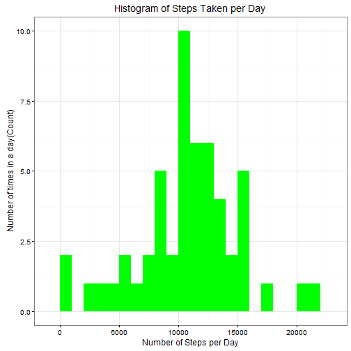

# Reproducible Research: Peer assessment 1
### *Steven Devisch*
### *February 20th 2016*
###### Github repository : https://github.com/viskinho/RepData_PeerAssessment1
#==============================================================
        
## Introduction
Purpose of this assignment is to write a report that answers the questions detailed below. 

Ultimately, one was required  to complete the entire assignment in a single R markdown document
that can be processed by knitr and be transformed into an HTML file.
See https://github.com/viskinho/RepData_PeerAssessment1 for more details

## Prepare the R environment

The assignment requires that throughout the report to echo code chunks such that 
someone else will be able to read the code at any time. 

We therefore we set echo equal a **TRUE** and results equal a **'hold'** as 
global options for this document.  


```r
library(knitr)
opts_chunk$set(echo = TRUE, results = 'hold')
```

### Load required libraries

```r
library(data.table) #more advanced than dataframes
library(ggplot2) # we shall use ggplot2 for plotting figures
librar(Hmis) # will help with imputations
```


## Loading and preprocessing the data

This assignment makes use of data from a personal activity monitoring device. This device collects data at 5 minute intervals through out the day. The data consists of two months of data from an anonymous individual collected during the months of October and November, 2012 and include the number of steps taken in 5 minute intervals each day.  

### Load the required data

```r
activityData <- read.csv('activity.csv', header = TRUE, sep = ",",
colClasses=c("numeric", "character", "numeric"))
```

### preprocess the data

We convert the DATE field to `Date` class and factorize INTERVAL as we excect the intervals to be used as categories, not as numbers to perform computations on

```r
activityData$date <- as.Date(activityData$date, format = "%Y-%m-%d")
activityData$interval <- as.factor(activityData$interval)
```

Checking out the data using 'head()', 'View()' and `str()` methods:


```r
str(activityData)
head(activityData)
View(activityData) #note the significant amount of NA's
table(activityData$date) #note that each date has 288 datapoints
```

```
## 'data.frame':	17568 obs. of  3 variables:
##  $ steps   : num  NA NA NA NA NA NA NA NA NA NA ...
##  $ date    : Date, format: "2012-10-01" "2012-10-01" ...
##  $ interval: Factor w/ 288 levels "0","5","10","15",..: 1 2 3 4 5 6 7 8 9 10 ...
```

## determine the mean number of total steps taken per day

We calculate the total steps per day by leveraging aggregate which by default ignores missing values.
We assign specific column names as this is not done automatically by aggregate in a consumable format

```r
stepsPerday <- aggregate(steps ~ date, rdata, sum)
colnames(stepsPerday) <- c("date","steps")
head(stepsPerday) # confirm the expected result
table(stepsPerday$date) # note that now each date only has 1 datapoint
```

```
##         date steps
## 1 2012-10-02   126
## 2 2012-10-03 11352
## 3 2012-10-04 12116
## 4 2012-10-05 13294
## 5 2012-10-06 15420
## 6 2012-10-07 11015
```

1. Make a histogram of the total number of steps taken per day.

```r
ggplot(stepsPerday, aes(x = steps)) + 
geom_histogram(fill = "blue", binwidth = 1500) + 
labs(title="Histogram of Steps Taken per Day", 
x = "Steps per Day", y = "Number of times in a day by bin 1500")
```



2. Now we calculate the mean and medium


```r
stpsMean   <- mean(stepsPerday$steps, na.rm=TRUE)
stpsMedian <- median(stepsPerday$steps, na.rm=TRUE)
```

The mean is **10766.189** and median is **10765**.

## What is the average daily activity pattern?

```r
stepsPerInterval <- aggregate(rdata$steps, by = list(interval = rdata$interval),FUN=mean, na.rm=TRUE)
# convert to integers for plotting purposes
stepsPerInterval$interval <- as.integer(levels(stepsPerInterval$interval)[stepsPerInterval$interval])
colnames(stepsPerInterval) <- c("interval", "steps")
```


1. plot avg steps over 5-minute intervals:

```r
ggplot(stepsPerInterval, aes(x=interval, y=steps)) +   
geom_line(color="blue", size=1) +  
labs(title="Average Daily Activity", x="Interval", y="Avg steps")
```


2. Find the 5-minute interval with the containing the maximum number of steps:


```r
maxinterval <- stepsPerInterval[which.max(  
stepsPerInterval$steps),]
```

Interval 835 has 206 steps.


## Imputing missing values:

### 1. Total number of missing values:

The total number of missing values in steps can be calculated using `is.na()` method to check whether the value is mising or not and then summing the logical vector.


```r
nrNAs <- sum(is.na(activityData$steps))
```

There are 2304 missing values

### 2. Fill in missing values in the dataset

Replace missing values with the mean 

We create a function `na_fill(data, pervalue)` which the `data` arguement is the `rdata` data frame and `pervalue` arguement is the `steps_per_interval` data frame.


```r
activityDataImproved <- activityData
activityDataImproved$steps <- impute(activityData$steps, fun=mean)

```

We check that are there any missing values remaining or not


```r
sum(is.na(activityDataImproved$steps))
```

```
## [1] 0
```

Zero output shows that there are ***NO MISSING VALUES***.


### 3. A histogram of the total number of steps taken each day

Re-plotting the histogram


```r
filledinStepsPerDay <- aggregate(steps ~ date, activityDataImproved, sum)
colnames(filledinStepsPerDay) <- c("date","steps")

##plotting the histogram
ggplot(filledinStepsPerDay, aes(x = steps)) + 
geom_histogram(fill = "blue", binwidth = 1000) + 
labs(title="Histogram of Steps Taken per Day", 
x = "Steps per Day", y = "Number of times in a day by bin 1000")
```


### Calculate and report the **mean** and **median** total number of steps taken per day.


```r
stepsMeanImputed   <- mean(filledinStepsPerDay$steps, na.rm=TRUE)
stepsMedianImputed <- median(filledinStepsPerDay$steps, na.rm=TRUE)
```

The mean is **10766.189** and median is **10766.189**.

### Do these values differ from the estimates from the first part of the assignment?

Yes, these values do differ slightly.

- **Before filling the data**
1. Mean  : **10766.189**
2. Median: **10765**


- **After filling the data**
1. Mean  : **10766.189**
2. Median: **10766.189**

Results from median and mean are equal

### What is the impact of imputing missing data on the estimates of the total daily number of steps?

No impact

## Are there differences in activity patterns between weekdays and weekends?

Plot the two data sets side by side for comparison.  


```r
activityDataImproved$dateType <-  ifelse(as.POSIXlt(activityDataImproved$date)$wday %in% c(0,6), 'weekend', 'weekday')
}

data_weekdays <- data_by_weekdays(rdata_fill)
```

averagedActivityDataImputed <- aggregate(steps ~ interval + dateType, data=activityDataImproved, mean)
ggplot(averagedActivityDataImputed, aes(interval, steps)) + 
    geom_line() + 
    facet_grid(dateType ~ .) +
    xlab("5-minute interval") + 
    ylab("avarage number of steps")
    
    
Below you can see the panel plot comparing the average number of steps taken per 5-minute interval across weekdays and weekends:
        
        ```r
        ggplot(data_weekdays, aes(x=interval, y=steps)) + 
        geom_line(color="violet") + 
        facet_wrap(~ dayofweek, nrow=2, ncol=1) +
        labs(x="Interval", y="Number of steps") +
        theme_bw()
        ```
        
        

We can see at the graph above that activity on the weekday has the greatest peak from all steps intervals. But, we can see too that weekends activities has more peaks over a hundred than weekday. This could be due to the fact that activities on weekdays mostly follow a work related routine, where we find some more intensity activity in little a free time that the employ can made some sport. In the other hand, at weekend we can see better distribution of effort along the time.
